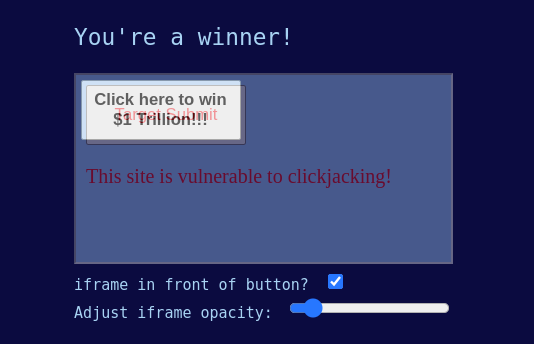
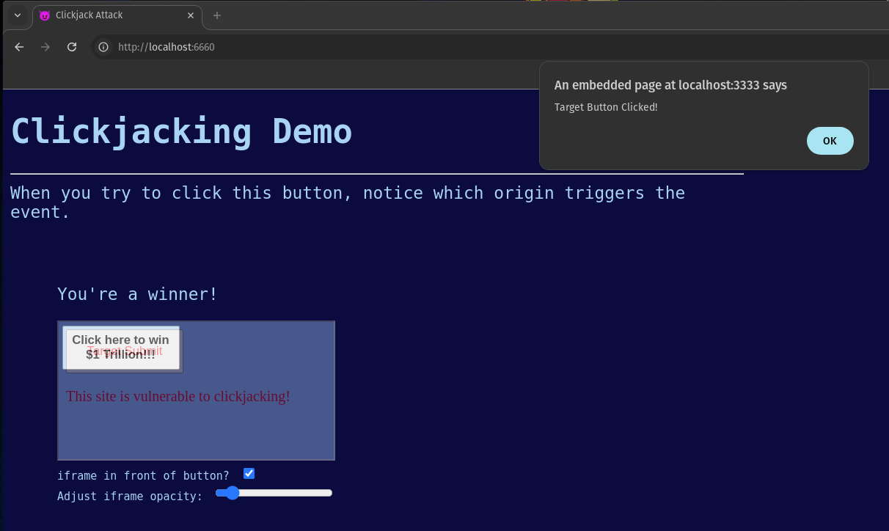

# Clickjacking Demo
In this demo, the attacker's website (on `http://localhost:6660`) embeds a vulnerable target website (on `http://localhost:3333`) in a semi-transparent iframe and places it over a button.

When the user attempts to click the button, the target website is clicked instead, as indicated by the alert message.

## Run the Demo
1. Execute the commands to copy this project to your local machine, install dependencies, and start the servers:
```shell
git clone https://github.com/pete-pub-prof/clickjacking-demo.git
cd clickjacking-demo
npm install
npm run demo
```

2. Navigate a browser to `http://localhost:6660` (the "attacker's" website).

3. Click the button - who could resist?



Note the alert is from the victim's origin, not the one in your URL bar!


## Clickjacking Mitigations

### Security Headers 

#### CSP directives:
  - `frame-src`
  - `frame-ancestors`

#### Effect of `X-Frame-Options` header
